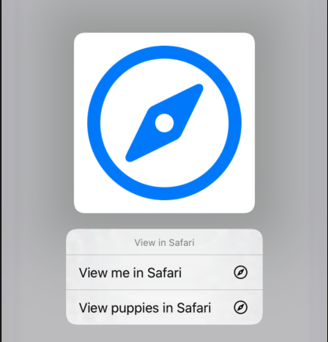
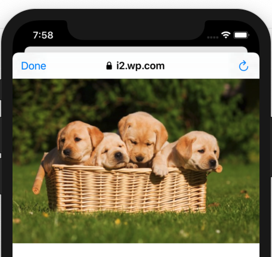

#  ContextMenuDemo
## How to display a context menu

Ref: https://developer.apple.com/design/human-interface-guidelines/ios/controls/context-menus/

New in iOS 13, context menus provide way of attaching a selection of actions to a view.
Context menus are activated by a long press.

For example, this demo displays a Safari icon. 
If the user long-presses on the icon they get a context menu allowing them to display a selection of images in Safari:





``` swift
//
//  ViewController.swift
//  ContextMenuDemo
//
//  Created by Russell Archer on 15/09/2019.
//  Copyright © 2019 Russell Archer. All rights reserved.
//

import UIKit
import SafariServices

class ViewController: UIViewController {
    @IBOutlet weak var imageView: UIImageView!

    override func viewDidLoad() {
        super.viewDidLoad()

        let interaction = UIContextMenuInteraction(delegate: self)

        imageView.isUserInteractionEnabled = true  // If you don't enable interactions the menu a long press doesn't work
        imageView.addInteraction(interaction)  // You can now long press on the imageview
    }
}

extension ViewController: UIContextMenuInteractionDelegate {
    func contextMenuInteraction(_ interaction: UIContextMenuInteraction, configurationForMenuAtLocation location: CGPoint) -> UIContextMenuConfiguration? {
        return UIContextMenuConfiguration(identifier: nil, previewProvider: nil) { suggestedActions in

            // Create menu actions...
            
            let me = UIAction(title: "View me in Safari", image: UIImage(systemName: "safari")) { action in
                
                let url = URL(string: "https://rarcher.co.uk/wp-content/uploads/2018/05/designCons-1.png")
                let svc = SFSafariViewController(url: url!)
                svc.modalPresentationStyle = .automatic
                self.present(svc, animated: true, completion: nil)
            }
            
            let puppies = UIAction(title: "View puppies in Safari", image: UIImage(systemName: "safari")) { action in
                
                let url = URL(string: "https://i2.wp.com/metro.co.uk/wp-content/uploads/2018/03/739281687.jpg?quality=90&strip=all&zoom=1&resize=644%2C429&ssl=1")
                let svc = SFSafariViewController(url: url!)
                svc.modalPresentationStyle = .automatic
                self.present(svc, animated: true, completion: nil)
            }

            return UIMenu(title: "View in Safari", children: [me, puppies])  // Return the context menu to use
        }
    }
}
```
